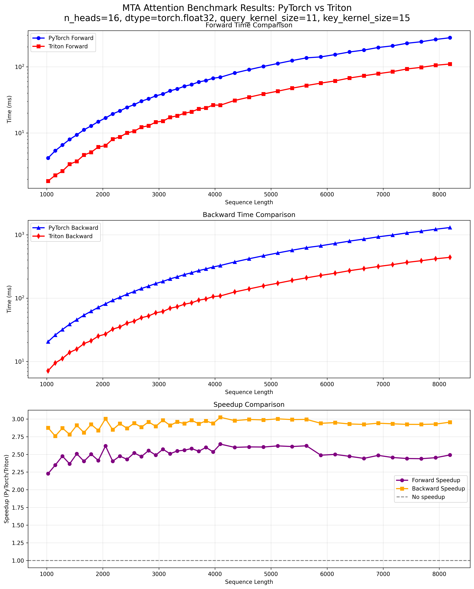
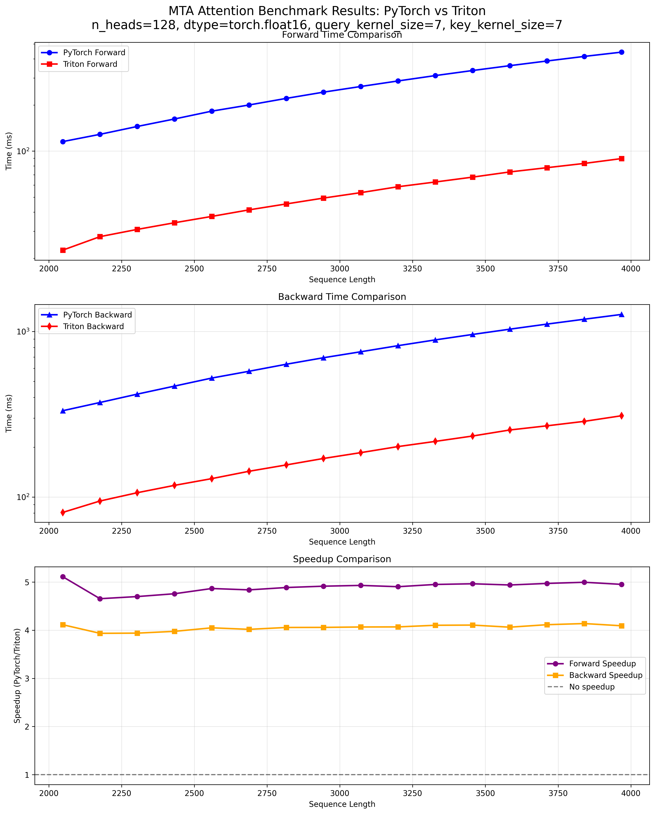

# Multi-Token Attention in Triton #

An implementation of Muli-Token Attention using some triton kernels to gain performance.

- (Paper)[https://arxiv.org/abs/2504.00927]
- (Original implementation)[https://github.com/facebookresearch/RAM/tree/main/projects/mta]

The convolution before and after the softmax makes it difficult to get performance gains by fusing the QK matrix multiplication, the softmax, and the multiplication with the value matrix in a single kernel, like in Flash-Attention. So I ended up creating kernels only for the convolution operation and the linear transformation in the head dimension.
These kernels achieve some speedup by:

- Skipping values that are going to be masked in the convolution and linear_head kernel.
- Masking implicitly inside the kernels.
- Avoiding transposition in the linear head kernel.

## Files ##

- convolution_2d_trit.py: A kernel for a convolution where groups equals channels, so we end up doing a 2d convolution in each channel. If the attention is causal, the entries above the diagonal are skipped.
- triton_linear_head.py: A kernel for a linear transformation across the heads dimensions, assuming an input tensor of shape (batch, n_heads, seq, seq). 
- mta_attention_pytorch.py: A simplified version of the original implementation, with less flexibility, to compare against.
- mta_attention_triton.py: Same as the above but using the triton kernels.
- compare_mta_attention.py: Script to compare pytorch and triton implementations.
- benchmark_mta_attention.py: Script to benchmark pytorch and triton implementations.
- benchmark_seq_len.py: Script to benchmark both implementations against different seq lengths.
- plot_benchmark_results.py: Script to plot results from benchmark_seq_len.py

## Results ##

With smaller convolution kernels or higher number of heads the speedup increases:

